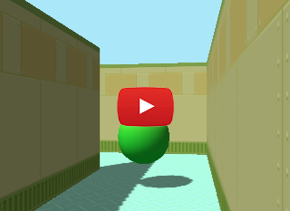

# Rodentia: Customizable 3D learning environment for MacOSX and Linux.

## Features

- Cross platform (MacOSX, Ubuntu)
- Easy install with pip
- You can design tasks only with python. (No C# or lua required)
- Multi camera rendering
- Rigidbody simulation
- Shadow mapping
- Multi agent

## Install with pip

### MacOSX

First confirm `cmake` in installed.

    $ cmake --version

If `cmake` is not installed, install it.

    $ brew install cmake

And install with `rodentia` with pip

    $ pip3 install rodentia

### Ubuntu

First confirm `cmake` in installed.

    $ cmake --version

If `cmake` is not installed, install it.

    $ sudo apt-get install cmake

And install with `rodentia` with pip

    $ sudo apt-get install -y python3-dev
    $ pip3 install rodentia

## Build from source

### MacOSX

First confirm `cmake` in installed.

    $ cmake --version

If `cmake` is not installed, install it.

    $ brew install cmake

Then install `rodentia`

    $ git clone https://github.com/miyosuda/rodentia.git
    $ cd rodentia
    $ pip3 install .

### Ubuntu

First confirm `cmake` in installed.

    $ cmake --version

If `cmake` is not installed, install it.

    $ sudo apt-get install cmake

And install with `rodentia` with pip

    $ sudo apt-get install -y python3-dev
    $ git clone https://github.com/miyosuda/rodentia.git
    $ cd rodentia
    $ pip3 install .

## How to run example

### Ubuntu
    $ pip3 install pygame==1.9.6 Pillow
    $ python3 examples/01_seekavoid_arena/main.py

Note: Rodentia does not use pygame, but the sample code uses pygame and latest pygame version (2.0.1) has problem running rodentia. So version 1.9.6 should be used to run examples.

### MacOSX 
    $ pip3 install pygame==2.0.1 Pillow
    $ python3 examples/01_seekavoid_arena/main.py

## API

[Python API](https://miyosuda.github.io/rodentia/)
