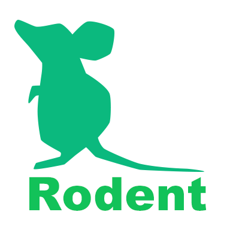

*Rodent* is a 3D learning environment for MacOSX and Linux.

You can easily design learning tasks with python. All of the scene objects can be updated with regid body simulation.

## Getting started on MacOSX

For Python2

    $ git clone https://github.com/miyosuda/rodent.git
    $ cd rodent
    $ cmake .
	$ make -j4
    $ python setup.py bdist_wheel
    $ pip install dist/rodent-0.1.0-py2-none-any.whl

	And then run example

	$ python example/seekavoid_arena/main.py

For Python3

    $ git clone https://github.com/miyosuda/rodent.git
    $ cd rodent
	$ cmake . -DBUILD_PYTHON3=ON
	$ make -j4
    $ python3 setup.py bdist_wheel
    $ pip3 install dist/rodent-0.1.0-py3-none-any.whl

	And then run example

	$ python3 example/seekavoid_arena/main.py

If you have trouble under Homebrew environment
   use

    $ cmake -DUSE_HOMEBREW=ON .

   instead of `cmake .`

   (When version of python exe and python libs doesn't match, an error ocurrs when executed. Thentry this `-DUSE_HOMEBREW=ON` option.)
