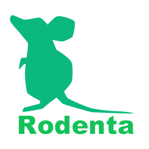

*Rodenta* is a 3D learning environment for MacOSX and Linux.

You can easily design learning tasks with python script. All of the scene objects can be updated with regid body simulation.

## Getting started on MacOSX

    $ git clone https://github.com/miyosuda/rodenta.git
    $ cd rodent
    $ cmake .
    $ make -j4
    $ python3 setup.py bdist_wheel
    $ pip3 install dist/rodenta-0.1.4-py3-none-any.whl

And then run example

    $ python3 examples/01_seekavoid_arena/main.py

## Getting started on Ubuntu

    $ sudo apt-get install -y python3-dev
    $ git clone https://github.com/miyosuda/rodent.git
    $ cd rodent
    $ cmake .
    $ make -j4
    $ python3 setup.py bdist_wheel
    $ pip3 install dist/rodent-0.1.4-py3-none-any.whl

And then run example

    $ python3 examples/01_seekavoid_arena/main.py

## API

[Python API](doc/python_api.md)
